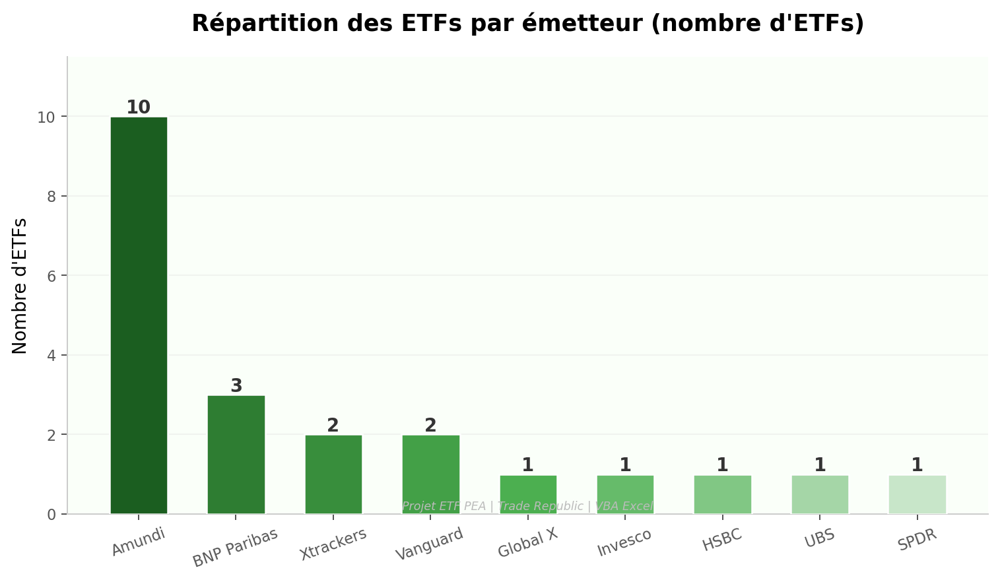
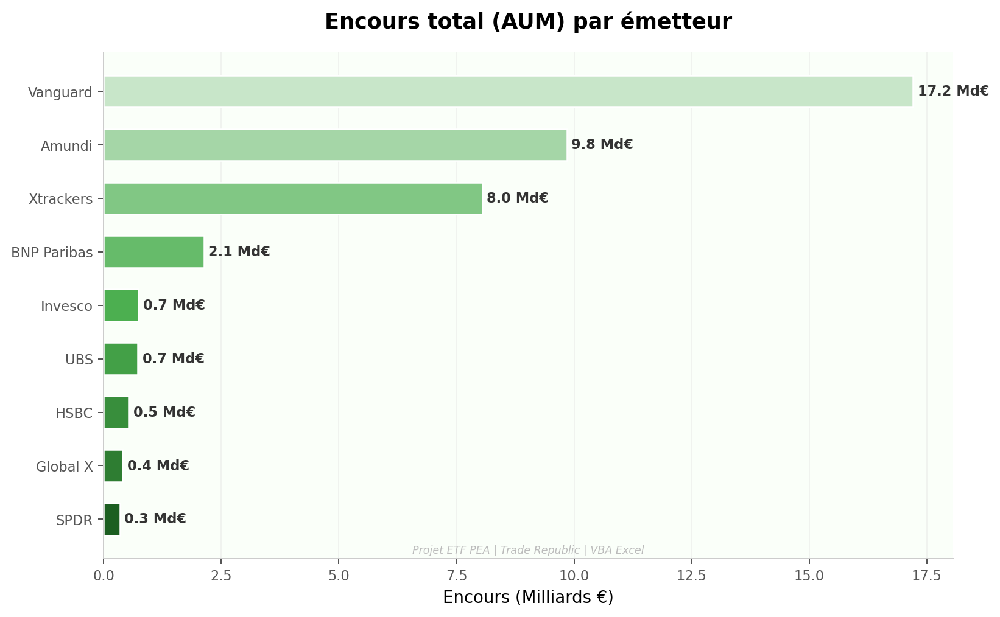
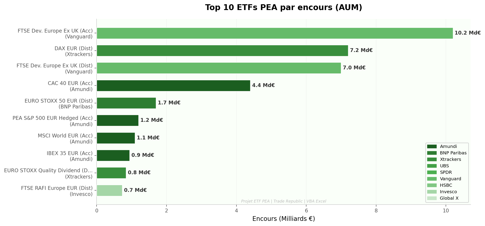
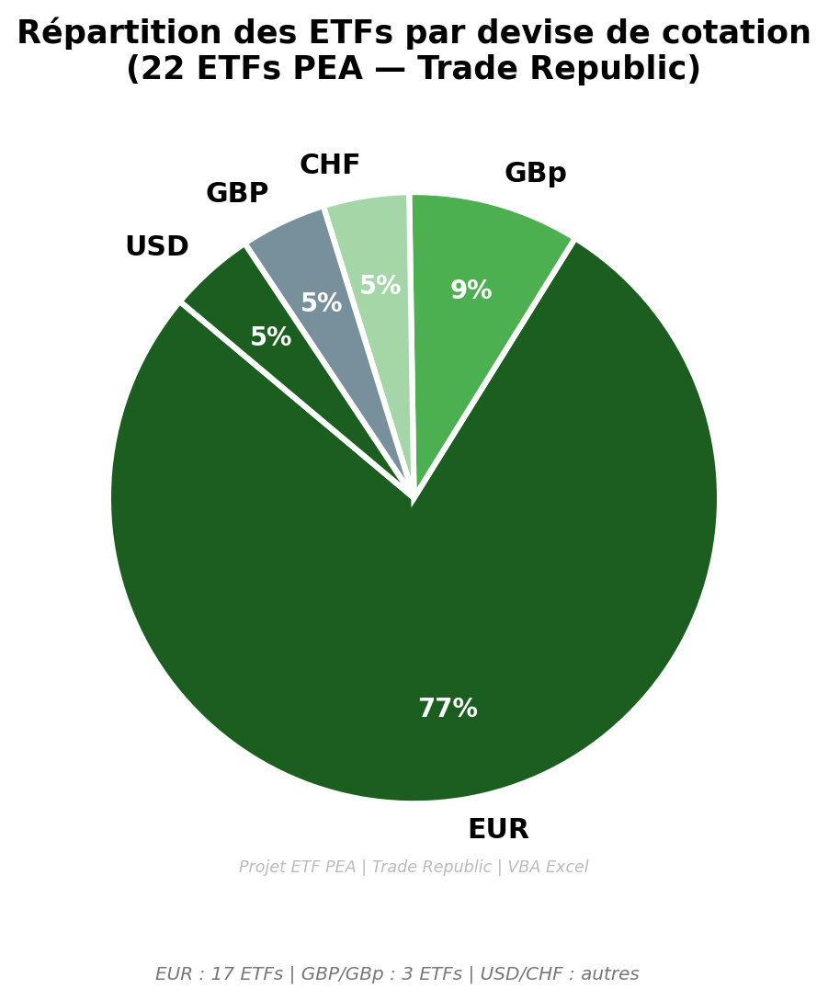
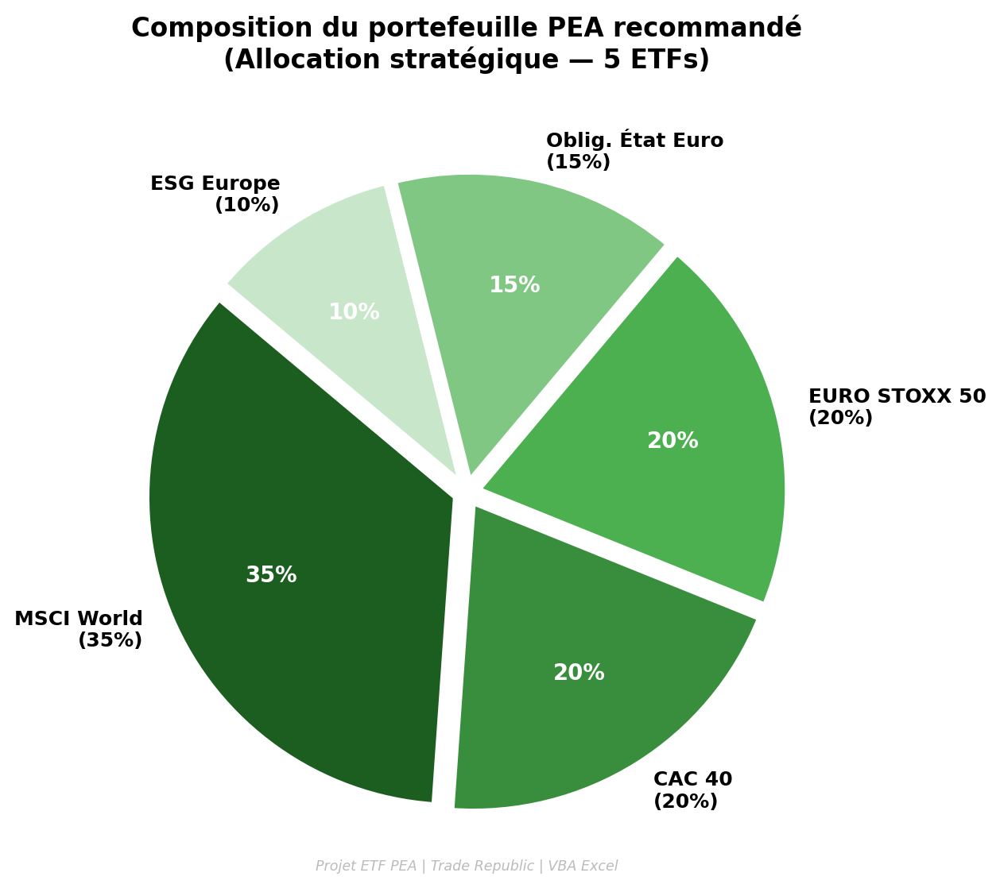
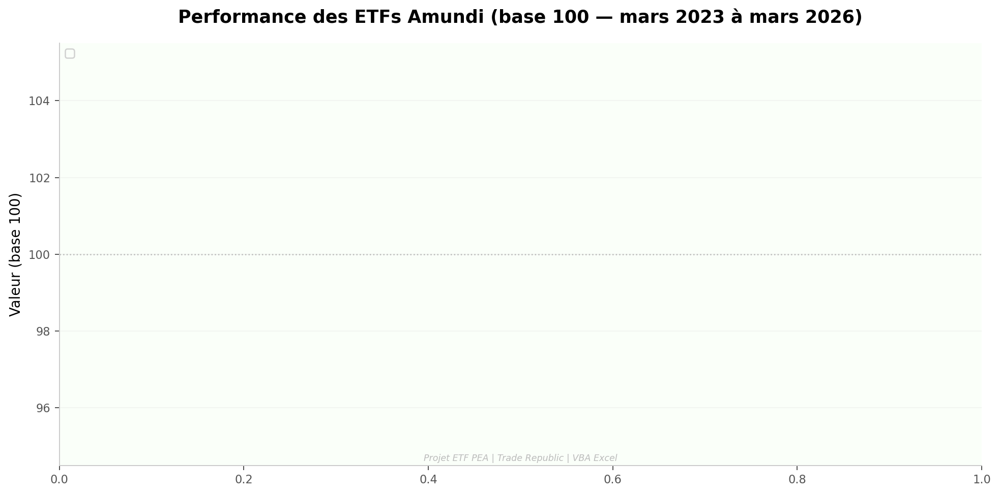
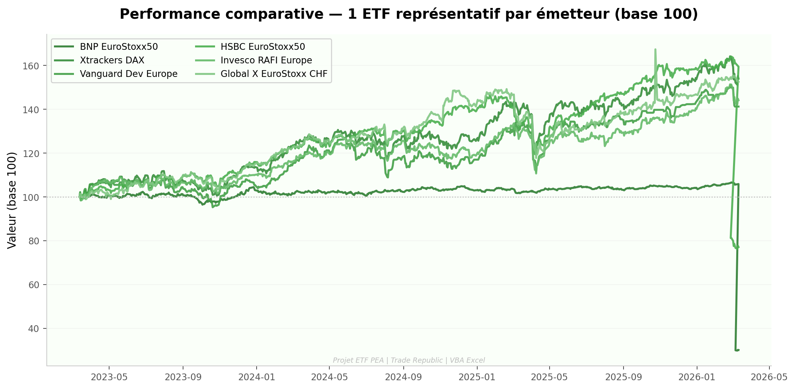
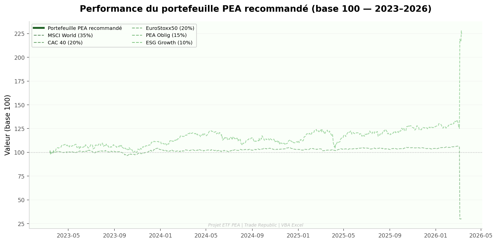
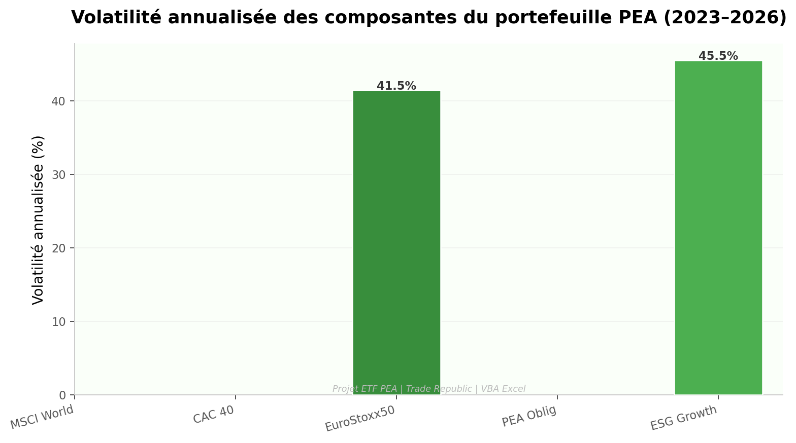
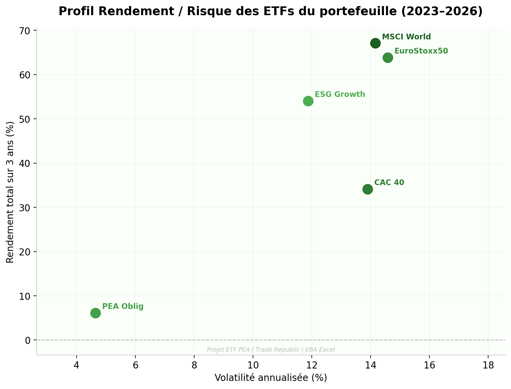

# 📈 Analyse ETFs PEA — Trade Republic

**Projet VBA Excel | Analyse de 22 ETFs éligibles au PEA**
**Plateforme : Trade Republic | Généré le 11/03/2026 | Auteur : TRAORE**

---

## 🎯 Objectif du projet

Ce projet VBA analyse **22 ETFs éligibles au PEA** disponibles sur **Trade Republic**, répartis entre 9 émetteurs majeurs. Il fournit :

- Un **récapitulatif consolidé** de tous les ETFs (ISIN, prix, encours)
- Un **historique de prix sur 3 ans** (mars 2023 – mars 2026) par émetteur
- Une **allocation de portefeuille recommandée** sur 5 ETFs clés
- Des **graphiques automatiques** générés par macro VBA

---

## 📁 Contenu du fichier

| Feuille | Description |
|---|---|
| `📊 Récapitulatif` | Liste consolidée des 22 ETFs avec prix et encours |
| `Amundi` | Historique 3 ans — 10 ETFs Amundi |
| `BNP Paribas` | Historique 3 ans — 3 ETFs BNP Paribas |
| `Xtrackers` | Historique 3 ans — 2 ETFs DWS/Xtrackers |
| `UBS` | Historique 3 ans — 1 ETF UBS |
| `SPDR` | Historique 3 ans — 1 ETF State Street SPDR |
| `Vanguard` | Historique 3 ans — 2 ETFs Vanguard |
| `HSBC` | Historique 3 ans — 1 ETF HSBC |
| `Invesco` | Historique 3 ans — 1 ETF Invesco |
| `Global X` | Historique 3 ans — 1 ETF Global X |

---

## 🏦 Les 22 ETFs analysés

| ETF | Émetteur | ISIN | AUM |
|---|---|---|---|
| PEA S&P 500 EUR Hedged (Acc) | Amundi | LU1650491282 | 1,2 Md€ |
| MSCI World EUR (Acc) | Amundi | FR0013412285 | 1,1 Md€ |
| CAC 40 EUR (Acc) | Amundi | FR0013380607 | 4,4 Md€ |
| Core CAC 40 EUR (Dist) | Amundi | FR0010468983 | 208 M€ |
| MSCI EMU SRI PAB EUR (Acc) | Amundi | FR0013412020 | 637 M€ |
| MDAX ESG EUR (Dist) | Amundi | FR0011440478 | 53 M€ |
| FTSE MIB EUR (Dist) | Amundi | FR0010010827 | 688 M€ |
| IBEX 35 EUR (Acc) | Amundi | FR0010251744 | 944 M€ |
| MSCI Greece EUR (Dist) | Amundi | FR0010405431 | 432 M€ |
| PEA Obligations d'État Euro (Acc) | Amundi | FR0013346681 | 183 M€ |
| EURO STOXX 50 EUR (Dist) | BNP Paribas | FR0012739431 | 1,7 Md€ |
| EURO STOXX 50 ESG EUR (Dist) | BNP Paribas | FR0013411980 | 153 M€ |
| ESG Growth Europe EUR (Acc) | BNP Paribas | FR0013412038 | 275 M€ |
| DAX EUR (Dist) | Xtrackers | LU0274211480 | 7,2 Md€ |
| EURO STOXX Quality Dividend (Dist) | Xtrackers | LU0292096186 | 845 M€ |
| Euro Stoxx 50 (Dist) | UBS | LU0136234068 | 726 M€ |
| MSCI EMU (Acc) | SPDR | IE00B910VR50 | 341 M€ |
| FTSE Dev. Europe Ex UK (Acc) | Vanguard | IE00BKX55T58 | 10,2 Md€ |
| FTSE Dev. Europe Ex UK (Dist) | Vanguard | IE00B945VV12 | 7,0 Md€ |
| Euro Stoxx 50 EUR (Dist) | HSBC | FR0010790980 | 531 M€ |
| FTSE RAFI Europe EUR (Dist) | Invesco | IE00B23D8S39 | 732 M€ |
| Euro STOXX 50 CHF Hedged (Acc) | Global X | IE00B6R52143 | 398 M€ |

---

## 💼 Portefeuille PEA recommandé

| ETF | Allocation |
|---|---|
| Amundi MSCI World EUR (Acc) | **35%** |
| Amundi CAC 40 EUR (Acc) | **20%** |
| BNP EURO STOXX 50 EUR (Dist) | **20%** |
| Amundi PEA Obligations d'État Euro (Acc) | **15%** |
| BNP ESG Growth Europe EUR (Acc) | **10%** |

---

## 📊 Graphiques

### 1. Répartition des ETFs par émetteur

---

### 2. Encours (AUM) par émetteur

---

### 3. Top 10 ETFs par encours

---

### 4. Répartition par devise de cotation

---

### 5. Composition du portefeuille recommandé

---

### 6. Performance des ETFs Amundi (base 100)

---

### 7. Performance comparative par émetteur

---

### 8. Performance du portefeuille PEA recommandé

---

### 9. Volatilité annualisée des composantes

---

### 10. Profil Rendement / Risque

---

## 🛠️ Technologies utilisées

- **VBA Excel** — Macros pour la collecte de données et la génération de graphiques
- **Python** — Visualisations avancées (pandas, matplotlib)
- **Trade Republic** — Source des données de prix

---

*Projet réalisé par TRAORE — tsory728@gmail.com — 2026*
